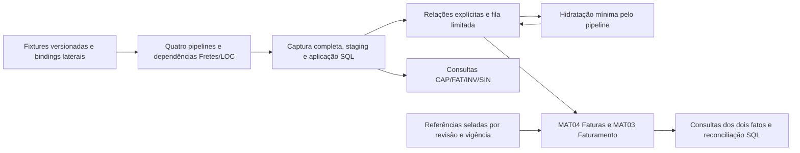

# Expansão funcional integrada do ETL V2

Estado: **EXPANSION_LOCAL_COMPLETE**. A–N encerradas no escopo de construção sintética local adotado.

As quatro novas verticais capturam e persistem seus151 campos pelos parsers,
guards, auditoria, staging JDBC e aplicação SQL reais. Bindings explícitos,
referências seladas e fila SQL integram Faturas por Cliente, Inventário e
Sinistros às dependências Fretes/Localização. CAP conserva sua própria cadeia
raiz/parcela/rateio. O cenário encontra um Frete ausente, hidrata somente esse
alvo pelo pipeline, resolve vínculos e carrega os fatos Faturas e Faturamento.
Seis consultas SQL/JDBC devolvem páginas tipadas e reconciliação sanitizada.

O runner companheiro usa o mesmo JAR e sessão rollback-only, com comandos
scenario/hydrate/replay/status/query. O cenário é composto, não seis cargas
finais inseridas diretamente por testes. Planos SQL exercitam BOOTSTRAP,
INCREMENTAL, BACKFILL e REPLAY, partições inversas/lacunas e nove fronteiras
de falha. Reabrir adapters recupera slots/capturas/recibos do SQL na mesma
transação. Cada processo prepara e reverte seu próprio cenário.

## Verificação da revisão entregue

verify-03 passou em Java17/Maven offline: **1775 testes unitários,
zero falhas/erros,4 skips históricos; 233 IT físicas,
zero falhas/erros/skips**. São95 regressões anteriores e138 IT novas.
Enforcer, Spotless, Checkstyle, arquitetura e limites de cobertura passaram.
870 fontes Java e os inputs de recursos/migrations/baseline/pom foram
comparados à cópia do build; as 746 classes do JAR foram comparadas
byte a byte às classes compiladas. Hash do JAR: `1c0b55a08aecd89e2f618d3306c7cddbea47878f692a021ebbcdfe4f25cb403f`.

Os21 processos JAR passaram, incluindo quatro comandos, seis seleções
de consulta e recusas de opt-in/fonte/alvo/path/budget/configuração. Status
degradado retorna10, configuração recusada20 e cenários completos0. O wrapper
impôs60s por processo e heap512MiB. Logs/exits e agregados estão em jar-01/.

Os151 campos têm readback físico independente, inclusive presença/wire/raw,
DECIMAL(28,8), IDs type-tagged, datas, segundo+nano, hora em nanos e arrays
ordenados. As159 contraprovas unitárias verificam um campo inválido por vez,
NULL distinto de erro, formato do envelope e limites de ocorrência.
Há provas de expansão entre páginas, vazio/parcial/cancelamento, escopo e
contrato divergentes, empate/stale/replay/no-op, reativação, padding/collation,
arrays, DST e comprovante cumulativo. MAT03/04 usam esperados manuais, incluindo
nulo/zero/decimal máximo, alteração de data, fiscal dual, aging, referências,
cancelamento e ausência de receita multiplicada por documentos.

A concorrência disputa as procedures efetivas de claim, aplicação, MAT04 e
MAT03 em duas sessões donas de suas transações. O segundo dono recebe busy
após1200ms; o primeiro reverte e o segundo prepara/consome seu escopo. Não é
uma prova de trava isolada ou de persistência após COMMIT/crash.

## Escala e planos

Massa lazy nas quatro fontes, Fretes/LOC, hidratação e duas cargas; teto240s
por caso, heap512MiB, página<=64KiB e lote<=16. O recorte16/64/256/64 foi
escolhido para as linhas tipadas largas e as duas cargas, preservando três
escalas crescentes e a repetição. Não herda a capacidade1024 do laboratório
relacional; a falha histórica4096 desse predecessor também não foi apagada.

| Raízes por vertical | Segundos | Pico amostral de heap MiB | Preparações JDBC |
| --- | --- | --- | --- |
| 16 | 4.518 | 165.49 | 78 |
| 64 | 13.336 | 166.25 | 207 |
| 256 | 44.618 | 168.90 | 725 |
| 64 | 13.961 | 168.04 | 207 |

Máximo observado: uma página e um lote em voo, retenção gerenciada de páginas
zero ao terminar. Preparações contam chamadas JDBC da aplicação antes dos
probes de plano; não contam statements internos das procedures. O resultado
financeiro por BRL/MAJOR foi100 por título e120 por Frete no cenário manual.
Esses números não provam platô de heap nem SLO produtivo.

Foram inspecionados148 planos reais,37 por caso: três de joins/dedupe/backlog
e34 das duas materializações. Zero plano com spill ou PlanAffectingConvert.
Oito planos têm ColumnsWithNoStatistics em colunas de componentes, vínculos
e observações; a limitação foi preservada e não se declara ausência de todos
os avisos/conversões. Seeks, scans, sorts e agregações observados:
Assert: 64; Clustered Index Insert: 32; Clustered Index Scan: 72; Clustered Index Seek: 238; Clustered Index Update: 8; Compute Scalar: 236; Concatenation: 12; Constant Scan: 36; Filter: 42; Hash Match: 64; Index Scan: 22; Index Seek: 39; Index Spool: 7; Merge Join: 18; Nested Loops: 301; Segment: 24; Sequence Project: 12; Sort: 85; Stream Aggregate: 76; Table Insert: 72; Table Scan: 136; Table Spool: 25.
Os scans/sorts são dos conjuntos processados pelo SQL; a medição e a revisão
não encontraram N+1 JDBC ou retenção do universo em Java a corrigir nesta escala.

## Schema, segurança e sucessão

V038–V051 foram instaladas em13 campanhas versionadas, após conferir o alvo
exato no master e Windows auth. Migrations aplicadas e ledgers são imutáveis;
a próxima versão livre éV052. Baseline SQLCMD inclui V001–V051 na mesma ordem.
Nenhuma IT/JAR executa DDL. SQL062 confirmou179 tabelas:143 preexistentes com
contagens preservadas,36 novas sem resíduos. Não houve reset/COMMIT de dado
sintético nem criação de banco. A equivalência física banco novo×upgrade não
foi executada; baseline foi verificado estaticamente e o upgrade local instalado.

Os12 validadores de schema/baseline/progressive, quatro contratos, quatro
identidades e portabilidade passaram. Scanner integral sem achados e11
contraprovas passaram. Gitleaks indisponível; nenhuma versão foi instalada e
nenhum feed externo de vulnerabilidades foi consultado. Validadores de sucessão, continuidade/runtime e revisão do delta passaram; resultados exatos no resumo estruturado.

O diff usa o inventário inicial de2549 arquivos, com snapshots byte a byte,
e nunca o HEAD sujo. Manifesto anterior SHA256
`17157a9dffd058e0ed703ca6b8179dd8dd551b309524e3d2a14a20cd974f453a`
permanece intacto. O sucessor confere a lista fechada de deltas, hashes before/
after, snapshots e arquivos preservados/novos; predecessores enxergam suas
fotografias históricas por essa cadeia exata, sem exceção genérica de drift.
Nenhum checkbox antigo foi mudado e não foi atribuído B64.

## Revisão, falhas e recuperação

As tentativas falhas permanecem nos logs/ledgers. A revisão corrigiu:

- Collation de comparações financeiras exatas por V048; V047 não foi reescrita.
- Qualificação da recomposição V049 e chaves da fixture que divergiam em caixa.
- Redução de valores correntes de componentes inativos por V050, mantendo
  comprovante histórico cumulativo. Uma quarta falha inicialmente atribuída
  à redução era vencimento da fixture FAT dominando o frescor; a retificação
  factual e os testes falhos foram preservados.
- Preparação da segunda transação nos testes de concorrência, antes da
  chamada real que disputa o lock.
- Arrays rcfdc/rctac/rctrc omitidos no CHECK da V038, corrigidos por V051.
- APIs Page/Batch/Limited e registro fechado de coleções limitadas, mantendo
  os predicados de arquitetura. verify-01 reprovado foi preservado.
- Cobertura insuficiente de ramos em verify-02, corrigida com159 contraprovas,
  sem reduzir mínimos. Essa campanha já havia executado233 IT sem falhas.
- Nome ambíguo payerToken nos recursos sintéticos, alterado para payerReference
  nos consumidores internos; comparação SQL do teste parametrizada. Scanner
  original e as três ocorrências foram preservados, sem ampliar allowlist.

A recuperação de DML é o rollback obrigatório da sessão, com commits
suprimidos. Falha de captura usa savepoint; falha de recomposição conserva
fronteira/categoria quando a transação permite registrar. Correções de schema
usam a próxima migration; não se oferece downgrade destrutivo nem alteração
retroativa de migrations. Nenhuma revisão humana externa foi alegada.

## Construção funcional e limites de aceite

Cobertura de unidades com mecanismo funcional local verificado: **26/45
(57,8%) →32/45 (71,1%)**, no mesmo universo do projeto inteiro. A fotografia
original tinha29; V2-016/017/048 são documentais/governança e foram corrigidas
simetricamente no antes/depois. As seis novas unidades são as quatro verticais
e MAT03/04; paiV2-036 não conta junto dos filhos. Cada linha declara seu
subescopo; não se trata de percentual de esforço/código/prazo nem de conclusão
integral dos pais. 67/115 permanece indicador de critérios históricos de aceite.
O STATES recebeu CONSTRUÍDO_LOCALMENTE_VERIFICADO diretamente nas capacidades,
com ACEITE_REAL_PENDENTE e lacunas. [Quadro completo](QUADRO-CONSTRUCAO.md).

Continuam externas: identidade/cardinalidade reais de raiz/parcela/título/
documento/ocorrência; correspondência nominal com Fretes; política fiscal dual,
grãos e unidades financeiros reais; formatos não observados; oráculos
independentes e janelas representativas; calendário/atribuição e responsáveis
nominais; Segurança/V2-041 e aceites de operação. Não se promoveram R01/R02,
V2-009/012/036/037/038/041/047/050 agregados por fixtures. Raster MANTER,
MAT01/02/05, dimensões não consumidas,19 views produtivas, frontend e cutover
ficam no escopo original pendente. Nenhuma API, .env, grant, produção, V1,
scheduler, deploy, commit ou push foi executado.

## Artefatos para revisão

[Matriz A–N](MATRIZ-A-N.md), [contrato](CONTRATO.md), [151 campos](MATRIZ-CAMPOS.csv),
[consultas](contratos-consultas.json), [comandos](COMANDOS.md),
[resumo verificável](verification-summary.json), [manifesto](manifesto.json),
[quadro de construção](QUADRO-CONSTRUCAO.md) e ADR0049.
Na rodada privada: inventory-before/after.json, before/, diff.patch completo,
diff-review.patch sem histórico duplicado, java-verification.json,
packaged-class-verification.json, scale-verification-verify03.json,
actual-plan-inspection-verify03.json, jar-01/, logs/, ledgers e recibos.
O checkpoint vigente e seu hash estão em docs/continuidade/RETOMADA.md.
